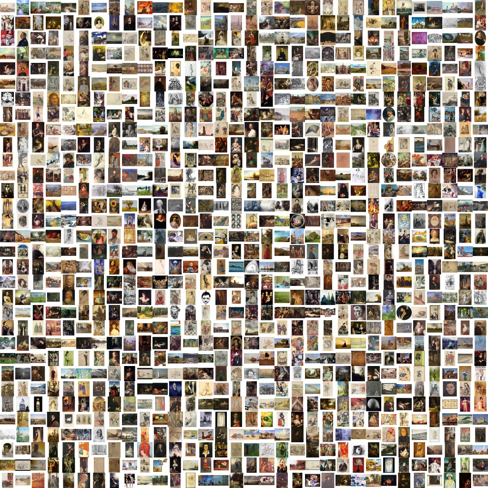
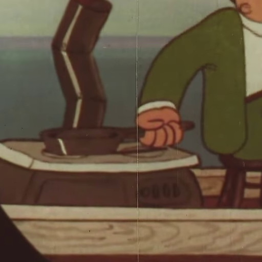

# Clean Diffusion (WIP)
Clean Diffusion is Latent Diffusion Model made of public domain images (CC-0).

You would download on [Hugging Face](https://huggingface.co/).
If you are Japanese, I recommend Clean Diffusion For Japanese (TBA) instead of Clean Diffusion (For Global). 
The model is more powerful than this global version.

# Note
> With great power comes great responsibility.

If you **CANNOT UNDERSTAND THESE WORDS**, I recommend that **YOU SHOULD NOT USE ALL OF DIFFUSION MODELS** what have great powers.

# Getting Started
You would be able to use Clean Diffusion by the following code soon.

```python
from diffusers import StableDiffusionPipeline
import torch

model_id = "alfredplpl/clean-diffusion"
pipe = StableDiffusionPipeline.from_pretrained(model_id, torch_dtype=torch.float16, revision="fp16")
pipe = pipe.to("cuda")

prompt = "A girl by Mucha."
image = pipe(prompt).images[0]
    
image.save("girl.png")
```

# Tuning
Clean Diffusion is less powerful than Stable Diffusion.
Therefore, I recommend to tune Clean Diffusion like Stable Diffusion 
because Clean Diffusion of the network architecture and Stable Diffusion of the network architecture are same.
And I repeat the words before I explain the detail.

> With great power comes great responsibility.

Please consider the words before you tune Clean Diffusion.

## Textual Inversion
TBA on Colab.

## Dreambooth on Stable Diffusion
TBA on Colab.

## Imagic Stable Diffusion
TBA on Colab.

## Pure fine-tuning
TBA

# Transparency of Clean Diffusion
I proof that clean diffusion is clean by following explanation.

## Legal information
TBA

### Training
Clean Diffusion is legal and ethical.

Clean Diffusion is MADE IN JAPAN.
Therefore, Clean Diffusion is subject to [Japanese copyright laws](https://en.wikipedia.org/wiki/Copyright_law_of_Japan).

TBA

### Generating

TBA

## Training Images
TBA

### List of works
- [ArtBench](https://github.com/liaopeiyuan/artbench) (public domain is True)
- Popeye the Sailor Meets Sindbad the Sailor

### Tiny training images
I would like to the all training raw images because these images are public domain.
However, these images are huge (70GB+).
Therefore, I have opened the tiny version like this.



[Tiny Images](https://1drv.ms/u/s!ApxVlgxlqLRliLpSC58y5qyAlt52tQ?e=3Yfwbt)

### Training Process of VAE





TBA

## Training text-image pairs
TBA

## Trainning code and config
Please read ldm_files folder. I refer to [stable-diffusion](https://github.com/runwayml/stable-diffusion) while I create these codes and configs.

TBA

# Acknowledgement
> Standing on the shoulders of giants

# Citations

```bibtex
@misc{rombach2021highresolution,
      title={High-Resolution Image Synthesis with Latent Diffusion Models}, 
      author={Robin Rombach and Andreas Blattmann and Dominik Lorenz and Patrick Esser and Björn Ommer},
      year={2021},
      eprint={2112.10752},
      archivePrefix={arXiv},
      primaryClass={cs.CV}
}
```
```bibtex
@article{liao2022artbench,
  title={The ArtBench Dataset: Benchmarking Generative Models with Artworks},
  author={Liao, Peiyuan and Li, Xiuyu and Liu, Xihui and Keutzer, Kurt},
  journal={arXiv preprint arXiv:2206.11404},
  year={2022}
}
```